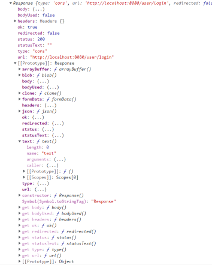

### AJAX

---

:book: 참고자료: 모던 자바스크립트 Deep Dive 43장


#### 1. AJAX?

​	브라우저가 서버에게 비동기 방식으로 데이터를 요청하고, 서버가 응답한 데이터를 수신하여 웹페이지를 <b>동적으로 갱신</b>하는 프로그래밍 방식.

* 변경할 부분을 갱신하는데 필요한 데이터만 서버로 전송받기 때문에, 불필요한 통신이 발생하지 않는다.

* 변경할 필요가 없는 부분은 다시 렌더링 하지 않는다.

* 클라이언트와 서버와의 통신이 비동기 방식으로 동작하기 때문에, 블로킹이 발생하지 않는다.


#### 2. JSON?

​	JavaScript Object Notation: 클라이언트와 서버 간의 http 통신을 위한 텍스트 데이터 포맷. 자바스크립트에 종속되지 않는 언어 독립형 데이터 포맷.

​	

​	:pencil: <b>Methods</b>

```javascript
1. JSON.stringify
// object -> json

const obj = { name: '코끼리' category: '대형'}
const json = JSON.stringify(obj);
console.log(typeof json, json)
// string { "name" : '코끼리', "category": "대형" }
// axios를 쓰면 필요가 없으나, fetch를 사용하면 반드시 사용해야 함!


2. JSON.parse
// json -> object

const parsed = JSON.stringify(json)
console.log(typeof parsed, parsed)
// object { name: '코끼리' category: '대형'}

```


:heavy_check_mark:프로젝트 진행시에 과연 이 메소드를 쓰게 될까?

```react
fetch("http://localhost:8080/user/login", {
      method: "POST",
      body: JSON.stringify(userInfo),
      headers: {
        "Content-Type": "application/json",
      },
    }).then((response) => {
      if (res.ok) {
        return res.json().then((data) => {
          authContext.setToken(data.accessToken);
          history.push("/");
        });
      } else {
        alert("아이디와 비밀번호를 확인해보세요");
      }
    });

// axios는 두번째 인자로 객체를 전달하면 알아서 serialization(obj -> json)을 해준다.
// parse()는 response.json()이 대체한다.
```


#### 3. fetch       

​	참고: [Response interface of Fetch API](https://developer.mozilla.org/en-US/docs/Web/API/Response)	

​	HTTP 요청 전송 기능을 제공하는 클라이언트 사이드 Web API

​	

```javascript
fetch("https://somewhere.com/")
	.then(response => console.log(response))

// http 응답을 나타내는 Response 객체를 래핑한 프로미스를 반환한다.
// 따라서, .then을 통해 resolve한 Response객체를 전달받을 수 있다.
```


 


<b>예제</b>

```javascript
fetch("https://naver.com/login/pcg0527")
.then(response => response.json())
.then(json => console.log(json))

// { user: 'pcg0527', token: 'dkj;lkjwqdfiejrjimvkld;11234;dfj' }
```


:star: <b>주의 사항</b>

fetch 함수가 반환하는 프로미스는 기본적으로 404 Not Found나 500 Internal Server Error과 같은 Http 에러가 발생해도 에러를 reject 하지 않고 boolean 타입의 'ok' 상태를 false로 설정한 Response 객체를 resolve 한다. 네트워크 장애, CORS 에러에 의해 요청이 완료되지 못한 경우에만 프로미스를 reject 한다.

-> Axios는 모든 http 에러를 reject 하는 프로미스를 반환한다. 따라서, 모든 에러를 catch에서 처리할 수 있기 때문에 매우 편리하다.

```javascript
fetch("http://localhost:8080/user/login", {
      method: "POST",
      body: JSON.stringify(userInfo),
      headers: {
        "Content-Type": "application/json",
      },
    }).then((res) => {
      if (res.ok) {
        return res.json().then((data) => {
          authContext.setToken(data.accessToken);
          history.push("/");
        });
      } else {
        alert("아이디와 비밀번호를 확인해보세요");
      }
    });
```

