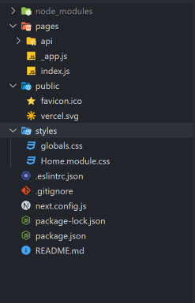

### NextJS

---

##### What is NextJS?

* "The React Framework for Production"

  Next.js는 복잡한 React 프로젝트를 만드는 것을 도와주는 프레임워크이다.

* 무엇을 도와주는가?

  <b>1. Built-in Server-Side Rendering</b>

  <b>2. File-based Routing</b>

  <b>3. FullStack</b>


##### Built-in Server-Side Rendering

* React만을 사용한 어플리케이션의 소스코드를 살펴보자

  ```html
  <!DOCTYPE html>
  <html lang="en">
  <head>
    <meta charset="UTF-8">
    <meta http-equiv="X-UA-Compatible" content="IE=edge">
    <meta name="viewport" content="width=device-width, initial-scale=1.0">
    <title>Document</title>
  </head>
  <body>
    <div id="root">
        
    </div>
  </body>
  </html>
  ```

  위의 소스코드는 서버에서 클라이언트로 전송된 것인데, 텅텅 비어있음을 확인할 수 있다.

  그렇다면 이게 왜 문제일까?

  * 클라이언트는 서버에서 html, js, css 파일을 받아 렌더링을 하게 된다.
  * 클라이언트는 빈 html을 채우기 위해 서버에 request를 보내고, response를 받을 것이다.
  * 즉, 처음부터 채워진(렌더링된) 페이지를 받으면 될 것을 일을 두 번 하게 되는 것이다.
  * SEO의 경우도 문제가된다. Search Engine도 위의 텅빈 html을 보게 된다.

  NextJS는 이와 같은 문제를 해결 하기위해 서버에서 pre-rendering을 제공한다.

  cf) 첫 접속에만 pre-rendering을 한다는 것이지, 완전히 Multi-Page Application을 만드는 것은 아니다. 여전히 React의 SPA의 골격을 갖추고 있다.

  

##### File-based Routing

* 기존 React 앱에서 Router를 사용하는 방법은 다음과 같다.

  ```react
  function App () {
      return (
      	<Layout>
          	<Switch>
              	<Route path='/' exact>
                  	<Homepage />
                  </Route>
                  <Route path='/login'>
                  	<Login />
                  </Route>
                  <Route path='/Signup' >
                  	<Signup />
                  </Route>
              </Switch>
          </Layout>
      )
  }
  ```

  

  

* 반면 NextJS에서는, "Pages" 폴더에 디렉토리 구조를 구축하는 것만으로 Router를 사용하는 것과 같은 효과를 누릴 수 있다. 즉, 코드 대신 파일과 폴더 구조를 사용하는 것이다.
* 이와 같은 방법은 html, css, js를 활용하여 웹 앱을 구축할 때와 같은 느낌을 줄 수 있다.


##### FullStack

* NextJS를 활용하면, 서버사이드 코드를 한 프로젝트 안에 같이 포함시킬 수 있다.


##### Creating NextJS Project

* ``` npx create-next-app```

* 폴더 구조

  

  * Public 폴더에 index.html이 없다?

    -> Pre-rendering과 관련있음. index.html을 클라이언트가 렌더링하는 것이아니라, pages폴더의 js파일을 서버가 먼저 렌더링하여 클라이언트에게 전송함.

* ```react
  // pages/index.js
  
  const HomePage = () => {
    return <div>HomePage</div>;
  };
  
  export default HomePage;
  
  ```

  * react를 import할 필요도 없다
  * pages의 index.js는 path='/'일 때 렌더링 되는 컴포넌트가 된다.
  * 소스코드를 확인해보면, 일반 react 앱과 달리 컨텐츠가 채워져 있음을 확인할 수 있다.

