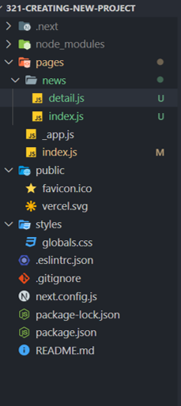

### **File-based Routing**

------

### **기본적인 라우팅 방법**



- '/' => pages/index.js
- '/news' => pages/news/index.js
- '/news/detail' => pages/news/detail.js

### **파라미터는 어떻게 사용할까?**

- 사용할 파라미터 이름을 스퀘어브라켓안에 넣어 파일이름으로 만든다.

- detail.js => [detail].js

- useRouter 훅을 사용하면 query오브젝트를 통해 파라미터에 접근할 수 있다

  ```
  import { useRouter } from "next/router";
  
  const Detail = () => {
    const router = useRouter();
  
    const pagename = router.query.detail;
  
    return <div>{pagename}</div>;
  };
  
  export default Detail;
  ```

### **Linking**

```
import Link from "next/link";
import { Fragment } from "react";

const NewsPage = () => {
  return (
    <Fragment>
      <h1>news</h1>;
      <ul>
        <li>
          <Link href="/news/test1">Test1</Link>
        </li>
        <li>
          <Link href="/news/test2">Test2</Link>
        </li>
      </ul>
    </Fragment>
  );
};

export default NewsPage;
```

- Link를 import한다.

- Link는 react의 Link와 작동방식이 유사하다

  => anchor 태그와 달리, 서버에 request를 보내지 않고 새로운 컴포넌트를 렌더링하도록 한다.